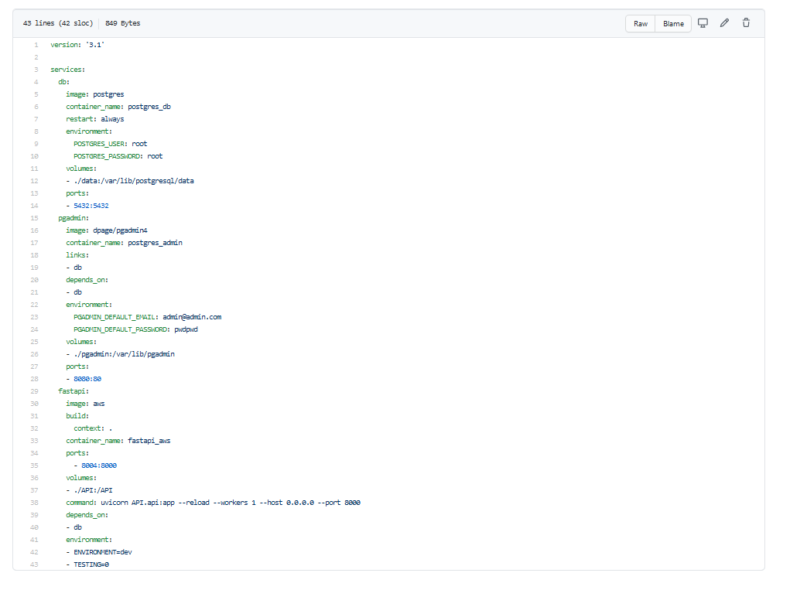

EN COURS DE REDACTION

# Une infra dans le Cloud

Contexte du projet

``Utiliser et mettre en place sur AWS :

    Une base de données PostgreSQL avec RDS,
    Un serveur avec EC2 pour accueillir l'appli Python,
    Ajouter du code Python test qui se connecte à la base et exécute au moins 2 requêtes 
    Créer un bucket sur S3 pour sauvegarder la fichier SQL.``

# bdd PostgresSQL avec AWS RDS.

Nous importons notre BBD via PostgresSQL dans AWS RDS.

Notre base de données :  

informations PostgresSQL : https://hub.docker.com/_/postgres

# serveur EC2

Nous créons l'instance sous EC2 en veillant à indiquer en adresse entrante des IP 0, cela nous permettra dans ce cas de nous connecter à notre convenance de n'importe quelle source (à éviter en terme de sécurité dans la vraie vie)

Nous créons une machine virtuelle via VScode.

A travers des containers nous insérons nos informations python via le docker-compose.yml (et ses fichiers annexes requirements.txt, dockerfile.txt)

Le fichier API est alimenté via le fichier config.py et le fichier aws.ini(fichier dans lequel nous indiquons les éléments pour la connexion à la base de donnéeset permet à notrefichier api d'être universel)

Nous pouvons nous connecter à l'API en indiquant notre adresseIPsuivie de docs

# bucket S3
Nous créeons un bucket dans AWS S3dans lequel on place notre base de données.

